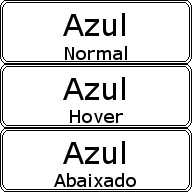

# BotaoSprite

* [BotaoSprite.h](https://github.com/GuilhermeAlanJohann/libUnicornio/blob/master/libUnicornio/include/Interface/BotaoSprite.h)
* [BotaoSprite.cpp](https://github.com/GuilhermeAlanJohann/libUnicornio/blob/master/libUnicornio/src/Interface/BotaoSprite.cpp)

Para se criar um módulo de __Menu__ na libUnicornio utiliza-se a classe __BotaoSprite__ que mapeia os spritesheets de acordo com os eventos.
O spritesheet deve possuir 1 frame para cada estado: __normal__, __hover__ e __abaixado__.



Para carregar o spritesheet utilizá-se o objeto global [__recursos__](./recursos).

```c
//	carrega os spritesheets para os botoes
recursos.carregarSpriteSheet("botao_azul", "dados/spritesheets/botao_azul.png", 3, 1);
```

Após carregado o spritesheets do botão, é preciso atribuí-lo ao objeto da classe __BotaoSprite__.

```c
//	instância do botao
BotaoSprite botaoVermelho, botaoVerde, botaoAzul;

//	setar spritesheet no botao
botaoAzul.setSpriteSheet("botao_azul");
```

Posicioná-lo na tela. Neste exemplo estamos usando as variáveis gloabais [res_x e res_y](./globais).

```c
//	posiciona o botao
botaoAzul.setPos(res_x/2, res_y/2 + 100);
```

Agora o botão esta pronto para ser utilizádo enquanto a aplicação estiver rodando. A cada iteração é preciso atualizar o estado em que se encontra o botão, assim eles irá mudar seus frames de acordo com o que foi mapeado.

```c
//	atualiza o botao
botaoAzul.atualizar();
```

Podendo agora desenhá-lo na tela.

```c
//	desenha o botao
botaoAzul.desenhar();
```

## Eventos

A classe __BotaoSprite__ possui métodos que retornm valores __boolean__ de acordo com os eventos disparados. Os eventos estão mapeados nos seguintes métodos:

* bool estaClicado();
* bool estaComMouseEmCima();
* bool estaAbaixado();
* bool mudouEstado();
* bool mouseEntrouEmCima();
* bool mouseSaiuDeCima();

Utilizando esses métodos é possível alterar a cena em que o jogador está:

```c
if(botaoAzul.estaClicado()){
	//	muda cor de fundo para azul
	uniSetCorDeFundo(0, 0, 255);
}
```